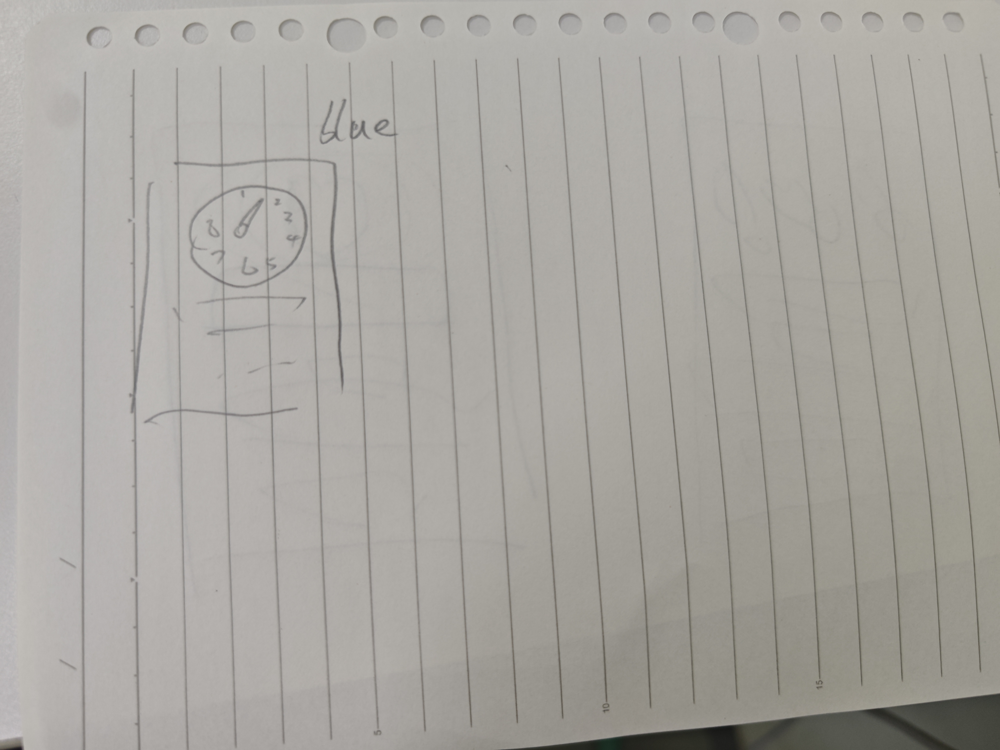
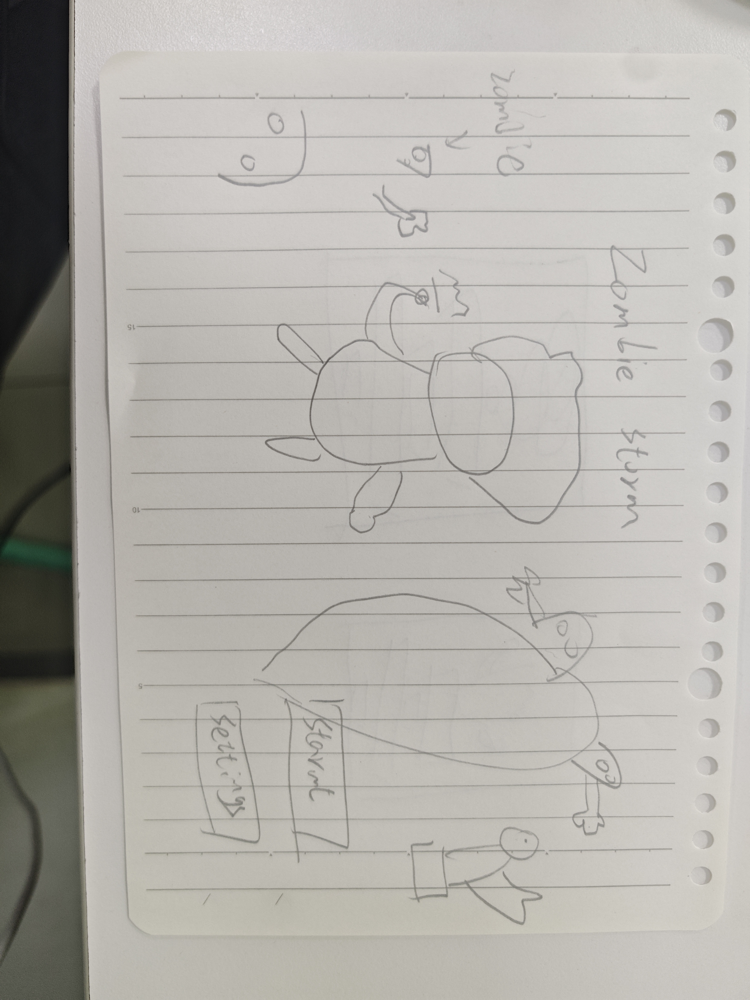
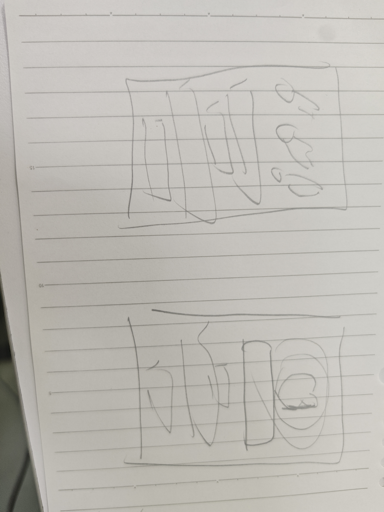
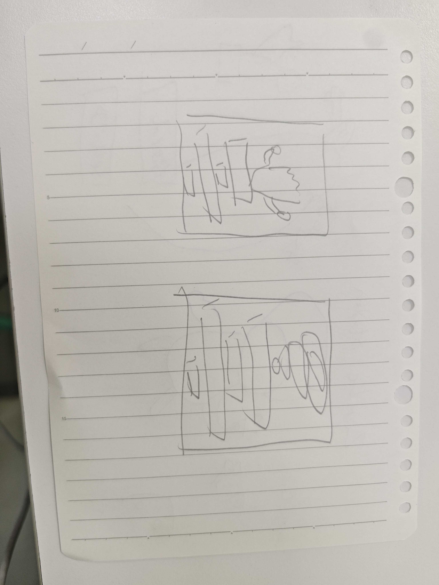

# Art and UI Drafts

These photographed hand-drawn sketches document early visual planning for
Zombie Storm. They explore the player HUD, title/menu composition, character
presentation, and screen/card layouts before the final in-game artwork was
assembled.

| Draft | Preview | Original source file |
| --- | --- | --- |
| HUD layout |  | `2477c19f44df5ee35113a474ec44ca92.jpg` |
| Main menu and character concept |  | `4a45d9bd15fcc280225f8254b9fe786d.jpg` |
| Interface layout concepts |  | `949b426722c3ad1af361ccce6f3c4814.jpg` |
| Story and upgrade layout concepts |  | `9aa3df176fbce617a8b2cfc51c87ab63.jpg` |

The photographs and sketches were created and supplied by the project owner.
They are development references rather than runtime game assets.
