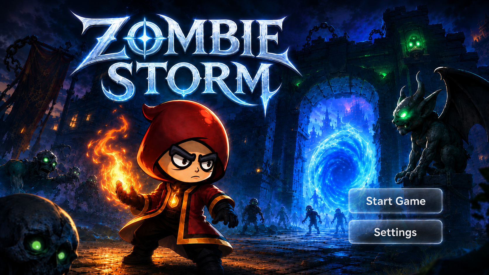
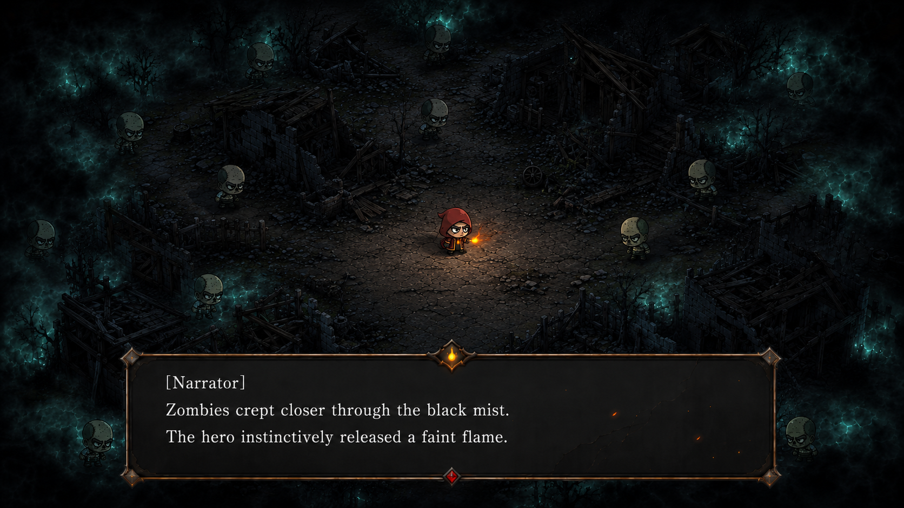
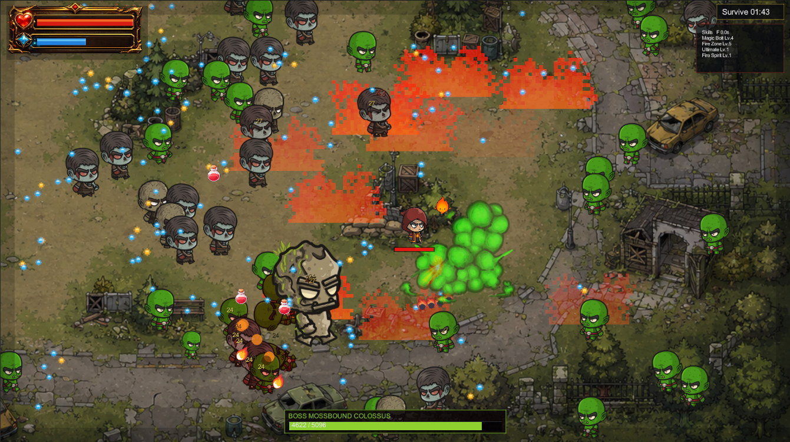
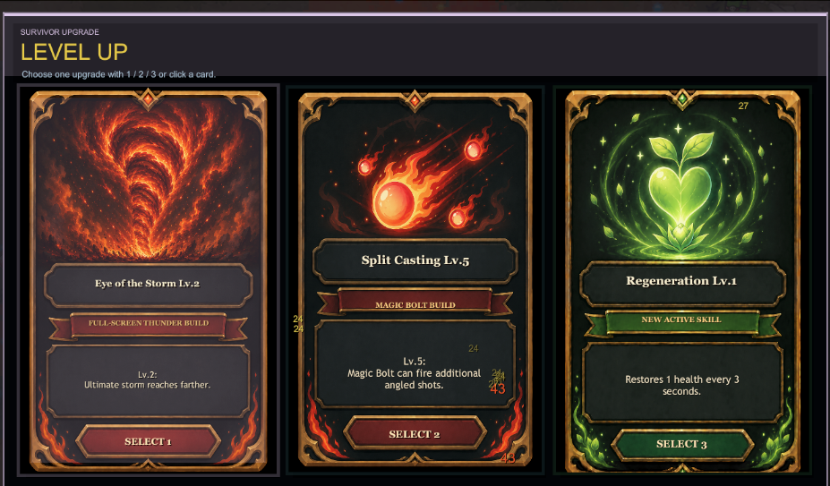

# Zombie Storm

Zombie Storm is a Unity 2D survival action game inspired by horde survival games, built around readable auto-casting skills, fast upgrade choices, and escalating boss waves.

## Screenshots

| Main Menu | Story |
| --- | --- |
|  |  |

| Combat | Upgrade Selection |
| --- | --- |
|  |  |

## Story

One night, a curse suddenly erupts in a magic village. Black mist swallows the village, turns most of its people into zombies, and leaves their home in ruins.

The hero awakens among the wreckage with no memory of the past. The only clue is a faint flame of magic still burning inside his chest. As zombies continue to emerge from the mist, he has no choice but to fight.

Defeated zombies leave behind glowing magic orbs. By absorbing enough of them, the hero recovers fragments of his memory and gradually reawakens the fire abilities he once possessed.

To survive, he must keep fighting, collect the magic orbs, rebuild his lost power, and search for the truth behind the curse.

## How To Play

- Survive for five minutes while increasingly dangerous zombie waves surround the ruined village.
- Use `WASD` to keep moving, avoid enemy attacks, and create space between the hero and the horde.
- The hero's learned skills cast automatically, so movement, positioning, and upgrade choices are the main focus.
- Defeat zombies and collect their glowing magic orbs to gain experience.
- After collecting enough orbs, choose one of three upgrades to learn a skill, strengthen an existing ability, or improve a passive effect.
- Build active skills up to their level cap and combine them with matching passives to form a stronger build.
- Defeat elite enemies and three boss waves before the final timer expires.

## Controls

- `WASD`: Move
- `F`: Ultimate storm, once unlocked
- `1 / 2 / 3`: Choose level-up upgrade
- `Esc` or `P`: Pause
- `Enter`: Start or restart from menu/results

## Skills And Progression

Active skills auto-cast after being learned:

- Magic Bolt
- Fire Blades
- Regeneration
- Fire Zone
- Fire Spirit
- Ultimate Storm

Most active skills are capped at Lv.5. Fire Zone is capped at Lv.4 and Regeneration is capped at Lv.3. Follow-up upgrades now bias toward skills you already own, so a fire, fire-blade, fire-spirit, or magic build can become more coherent over a run.

## Enemies

| Enemy | Characteristics |
| --- | --- |
| Goblin | The standard pursuer. It moves directly toward the hero and deals contact damage. |
| Small Goblin | A smaller, fragile enemy that moves extremely quickly and begins appearing after the first boss. |
| Slasher | A fast melee attacker with a dedicated strike animation and an occasional long-range leap attack. |
| Gravedigger | A slower, durable heavy enemy with powerful close-range swings. |
| Reaper | A dangerous melee specialist with longer reach, strong strikes, and a larger magic-orb reward. |
| Orc Thrower | A ranged enemy that tries to maintain distance and periodically throws damaging rocks at the hero. |

## Bosses

Boss attacks show warning effects before they land, giving the player time to reposition:

| Boss | Characteristics |
| --- | --- |
| Crystal Colossus | Uses heavy crystal slams and spreads volleys of ice shards across a wide angle. |
| Mossbound Colossus | Creates corrupted ground, poison pools, and delayed toxic bursts that restrict movement. |
| Ember Tyrant | Charges through the arena, leaves burning ground, fires flame volleys, and calls down large meteor barrages. |

Bosses become faster and more aggressive below half health.

## Validation

The project uses Unity `2022.3.62f3c1`. Verified checks include Unity script compilation, a successful Windows standalone build, runtime content packaging, and a standalone startup smoke test.

See [Testing and Debugging Report](Docs/TestingAndDebugging.md) for the test matrix, defect log, build evidence, known limitations, and release checklist.

Gameplay, UI, camera behavior, audio, and asset rendering are integrated in the Unity project.

## Asset Credits

Art packs, project-specific images, animation frames, effects, audio, fonts, screenshots, source archives, and generated fallback visuals are listed in the centralized [Asset Credits and References](Docs/AssetReferences.md).

Early hand-drawn visual planning is preserved in [Art and UI Drafts](Docs/ArtDrafts/README.md).
